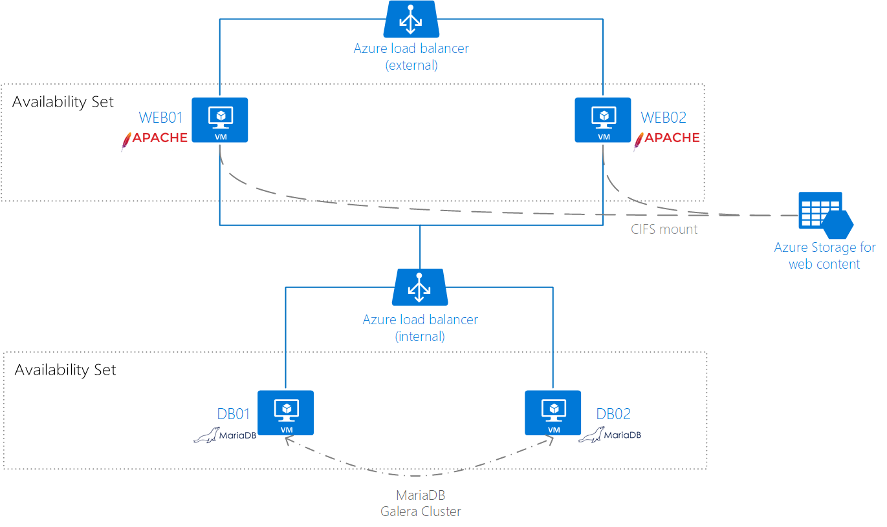
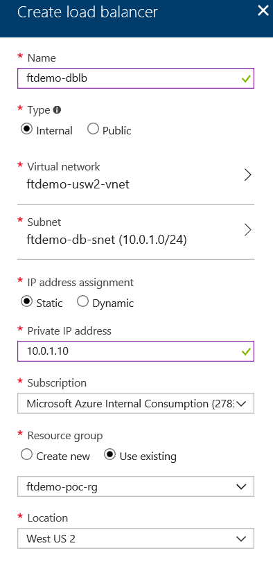

# POC Scenario 2: Deploying Wordpress on Azure IaaS VMs (Red Hat Enterprise Linux) - HTTP

## Table of Contents
* [Abstract](#abstract)
* [Learning objectives](#learning-objectives)
* [Prerequisites](#prerequisites)
* [Estimated time to complete this module](#estimated-time-to-complete-this-module)
* [Customize your Azure Portal](#customize-your-azure-portal)
* [Virtual Machine Creation](#virtual-machine-creation)
* [Connect to the Virtual Machine](#connect-to-the-virtual-machine)
* [Install MariaDB and Galera Cluster](#Install-MariaDB-and-Galera-Cluster)
* [Load Balancer Creation](#load-balancer-creation)
* [Add the VMs to Load Balancer](#add-the-vms-to-load-balancer)
* [Create the load balancing rule for MYSQL](#create-the-load-balancing-rule-for-mysql)
* [Add data disk to Web Servers](#add-data-disk-to-web-servers)
* [Configure Gluster Storage Replication](#configure-gluster-storage-replication)
* [Reconfigure Apache](#reconfigure-apache)
* [Prepare Wordpress Installation](#prepare-wordpress-installation)
* [Install Wordpress](#install-wordpress)
* [Testing](#testing)


# Abstract

During this module, you will learn about bringing together all the infrastructure components to build a Wordpress Website running on Linux and making it scalable, highly available and secure.



* Two DB servers will host MariaDB with Galera cluster for replication. In a production scenario a minimum of 3 nodes is required to avoid split-brain scenarios.
* An Azure Internal Load Balancer will distribute the traffic to the DB servers
* Two Web servers will host Apache. In a production scenario a minimum of 3 nodes is required to avoid split-brain scenarios.
* A data disk will be added to each Web Server
* Gluster storage will be configured on the Web Servers and will replicate the Web Server file content
* Wordpress will be installed on both Web Servers
* An Azure External Load Balancer will distribute the traffice to the Web servers

> Note: This document describes the steps for a proof of concept. Additional steps may be required for a production environment

# Learning objectives
After completing the exercises in this module, you will be able to:
* Create Linux Virtual Machine
* Create an Availability Set
* Create and configure a Load Balancer
* Configure a Highly Available MariaDB cluster with Azure Load Balancer
* Configure a Highly Available Wordpress site with storage replication (gluster)
* Adding a Managed Disk to an existing VM and initializing the disk in Linux

# Prerequisites 
* Complete the "Deploying Website on Azure IaaS VMs (Red Hat Enterprise Linux) - HTTP" as this scenario starts from the completed infrastructure configured on that PoC

[Deploying Website on Azure IaaS VMs (Red Hat Enterprise Linux)](https://github.com/Azure/fta-azurefundamentals/blob/master/iaas-fundamentals/articles/website-on-iaas-http-rhel.md)

# Linux Distribution
* This PoC release is based on the Red Hat Enterprise Linux OS and is expected to work on any distribution of the Red Hat Family. 

# Estimated time to complete this module
1.5 hour

# Virtual Machine Creation
  * Create 2 VMs for the database
  * Select from the marketplace, **Red Hat Enterprise Linux 7.3**
  * Name the 1st VM **(prefix)-db01-vm**
  * Name the 2nd VM **(prefix)-db02-vm**
  * Make sure to choose **HDD disk**
  * Choose password Authentication Type and make sure the user name is in lowercase only

    

  * For the size select **D1_V2**
  
  * Create an availability set named **(prefix)-db-as**
  > Note: During the 2nd VM creation pick the previously created Availability set  
  * Below Storage select **Yes** to **Use managed disks**
  * Select the previously create Virtual Network and the Web subnet
  
    

  * Create a Diagnostics Storage account named **(prefix)dbdiag**

   

  * After the Virtual machines are created, take note of the Public IP address for each Virtual Machine:

    

# Connect to The Virtual Machine

* For Windows download [SSH Putty client](https://www.chiark.greenend.org.uk/~sgtatham/putty/latest.html)

* Open four instances of the putty client and connect to the DB servers and Web servers

 

* Click "Yes" on the putty security alert
 

* For Linux or Mac just use the ssh command from the terminal
```bash
ssh azureadmin@<public ip address>
```
 

# Install MariaDB and Galera Cluster
From the SSH terminal, execute the following instructions on both DB servers.

  * Elevate privileges to root
  ```bash
  sudo su -
  ```

  * Install MariaDB and Galera Cluster
  ```bash
  yum install -y rh-mariadb101-mariadb-server-galera mariadb
  ```

  * Confirm the internal IP address of each server
  ```bash
  ifconfig
  ```

 * Open Galera configuration file
  ```bash
  nano /etc/opt/rh/rh-mariadb101/my.cnf.d/galera.cnf
  ```

 * Change wsrep_cluster_address with the Database Server IPs. Remove the "#" from the beginning of the line. 
  ```bash
  wsrep_cluster_address="gcomm://10.0.1.4,10.0.1.5"
  ```

   * Create Firewall exceptions:
  ```bash
  firewall-cmd --zone=public --add-port=3306/tcp --permanent
  firewall-cmd --zone=public --add-port=4567/tcp --permanent  
  firewall-cmd --zone=public --add-port=4568/tcp --permanent
  firewall-cmd --zone=public --add-port=4444/tcp --permanent
  firewall-cmd --reload
  ```   

 * CTRL+O to Save. CTRL+Q to Quit.

 * Bootstrap MariaDb service (execute only on server 1)
  ```bash
 scl enable rh-mariadb101 galera_new_cluster
  ```
 * Enable MariaDB service
  ```bash
  systemctl enable rh-mariadb101-mariadb.service
  ```  

 * Start MariaDB service
  ```bash
  systemctl start rh-mariadb101-mariadb.service
  ```  

 * Open mysql locally (first server only)
 ```bash
 mysql
 ```
* Create a new database (first server only)
```sql
CREATE DATABASE ftdemo;
```

* Create a new user for remote connection and grant privileges (first server only)
```sql
CREATE USER 'ftdemodbuser'@'%' IDENTIFIED BY '<New Password>';
GRANT ALL PRIVILEGES ON *.* TO 'ftdemodbuser'@'%' WITH GRANT OPTION;
```

# Load Balancer Creation
  * From the left panel on the Azure Portal, select **Load balancers**.
  * Click on **Add**
  * Name: **(prefix)-db-lb**
  * Type: **Internal**
  * Virtual Network: **(prefix)-vnet**
  * Subnet: **(prefix)-db-snet**
  * IP Address Assignment: Static
  * Choose one IP and remember it. For example 10.0.1.10.  
  
    

  * Select **Use Existing** for **Resource Group**, i.e. **(prefix)-poc-rg**, click **Create**
  * After the **Load Balancer** is created, select the one you added.
  * Under **Settings** select **Health probes**, click **Add**.
  * Enter name **(prefix)-db-prob**, changing the port to 3306, click **Ok**

   

# Add the VMs to Load Balancer
  * Under **Settings** select **Backend pools**, click **Add**.
  * Enter name **(prefix)-db-pool**.
  * For **Associated to**, select **Availability set**.
  * For the **Availability set**, select **(prefix)-db-as**.
  * Click **Add a target network IP configuration** to add the first web server and its IP address.

   

  * **Repeat** the step above to also add the IP configuration for the second web server.
  * Click **OK**.

# Create the load balancing rule for MYSQL
  * Under **Settings** select **Load balancing rules**, click **Add**.
  * Enter name **(prefix)-db-lbr**.
    *  Protocol: **TCP**
    *  Port: **3306**
    *  Backend port: 3306
    *  Backend pool: **(prefix)-db-pool(2VMs)**
    *  Probe: **(prefix)-db-prob(HTTP:3306)**
    *  Session Persistence: **None**
    *  Idle timeout (min):**4**
    *  Floating IP (direct server return): **Disabled**
    *  Click **Ok**

   


 # Add data disk to Web Servers
  * Open the Azure Portal
  * Select the First Web Server
  * Select Disks
  * Select "+Add Data Disks"
  * Create a new Managed Disk with 32 Gb with Standard tier

  

  * Connect to the server via SSH
  * Initialize the data disk using the following procedure: [Initialize Data Disk](https://docs.microsoft.com/en-us/azure/virtual-machines/linux/classic/attach-disk#initialize-a-new-data-disk-in-linux)

  * You can mount the new disk in /datadrive
  * Repeat the steps in the second server

# Configure Gluster Storage Replication

* Execute these steps on both WEB servers
* Add Gluster software repository by creating a new repo file
```bash
nano /etc/yum.repos.d/Gluster.repo
```

* Add the following configuration to the new file
```
[gluster38]
name=Gluster 3.8
baseurl=http://mirror.centos.org/centos/7/storage/$basearch/gluster-3.8/
gpgcheck=0
enabled=1
```
> Note: With a valid Red Hat Enterprise subscription different repositories would be used

* CTRL+O to Save. CTRL+Q to Quit.

* Install gluster storage
```bash
yum install -y glusterfs-server
```
* Enable the gluster service
```bash
systemctl enable glusterd
```

* Start the gluster service
```bash
systemctl start glusterd
```

* Add the gluster firewall exceptions
```bash
firewall-cmd --zone=public --add-port=24007-24008/tcp --permanent
firewall-cmd --zone=public --add-port=24009/tcp --permanent
firewall-cmd --zone=public --add-service=nfs --add-service=samba --add-service=samba-client --permanent
firewall-cmd --zone=public --add-port=111/tcp --add-port=139/tcp --add-port=445/tcp --add-port=965/tcp --add-port=2049/tcp --add-port=38465-38469/tcp --add-port=631/tcp --add-port=111/udp --add-port=963/udp --add-port=49152-49251/tcp --permanent
firewall-cmd --reload
```

* Enable http to use gluster in SELinux
```
setsebool -P httpd_use_fusefs 1
```

* On the first server, execute the probe command point to the second server
```bash
gluster peer probe 10.0.0.5
```

* On the second server, execute the probe command point to the first server
```bash
gluster peer probe 10.0.0.4
```

* Create a new gluster volume and start (Execute only or server 1)
```bash
gluster volume create volume1 replica 2 transport tcp 10.0.0.4:/datadrive 10.0.0.5:/datadrive force
gluster volume start volume1
```

* On the first server, Mount the gluster volume, point to the second server
```bash
mkdir /var/www/ftdemo
mount -t glusterfs 10.0.0.5:/volume1 /var/www/ftdemo
```

* And, still on the first server, add the following line to ***/etc/fstab*** for automatic mount
```
10.0.0.5:/volume1 /var/www/ftdemo glusterfs defaults,_netdev 0 0
```

* On the second server, Mount the gluster volume, point to the first server
```bash
mkdir /var/www/ftdemo
mount -t glusterfs 10.0.0.4:/volume1 /var/www/ftdemo
```

* And, still on the second server, add the following line to ***/etc/fstab*** for automatic mount
```
10.0.0.4:/volume1 /var/www/ftdemo glusterfs defaults,_netdev 0 0
```


# Reconfigure Apache

* Execute the following steps on both Web Servers
* Install additional packages for apache
```bash
yum install -y php php-common php-mysql php-gd php-xml php-mbstring php-mcrypt
```

* Enable selinux access to database
```bash
setsebool -P httpd_can_network_connect_db=1
```

* Create a new apache configuration file
```bash
nano /etc/httpd/conf.d/ftdemo.conf
```

* Include de following configuration on the new file
```
<VirtualHost *:80>
    ServerName <DNS NAME>.westus2.cloudapp.azure.com
    DocumentRoot /var/www/ftdemo
</VirtualHost>
```
* CTRL+O to Save. CTRL+Q to Quit.

* Restart apache
```bash
systemctl restart httpd
```

# Prepare Wordpress Installation 

* Execute these steps only on ***Web Server 1***
* Download the latest version of Wordpress and copy contents to the final location
```bash
cd /tmp
wget http://wordpress.org/latest.tar.gz
tar xzf latest.tar.gz
mv wordpress/* /var/www/ftdemo
```
* Give permissions to apache
```
chown -R apache:apache /var/www/ftdemo
```

* Open the wordpress configuration file
```
cd /var/www/ftdemo
cp wp-config-sample.php wp-config.php
nano wp-config.php
```

* Change the mysql settings. 
```
// ** MySQL settings - You can get this info from your web host ** //
/** The name of the database for WordPress */
define('DB_NAME', 'ftdemo');
/** MySQL database username */
define('DB_USER', 'ftdemodbuser');
/** MySQL database password */
define('DB_PASSWORD', '<Password>');
/** MySQL hostname */
define('DB_HOST', '<Azure Internal Load Balancer IP>');
```

# Install wordpress
  * Browse to the load balancer public IP dns: **http://(prefix).westus2.cloudapp.azure.com/**
  * You will see the WordPress Welcome Page
  * Fill out the form and click ***Install Wordpress***

   

   * When the installation is completed a success page will appear
   

   * Click ***Log in**, enter your credentials and ensure you can access the Wordpress backoffice
   


# Testing
 * Browse to the load balancer public IP dns **http://(prefix).westus2.cloudapp.azure.com/**
 

